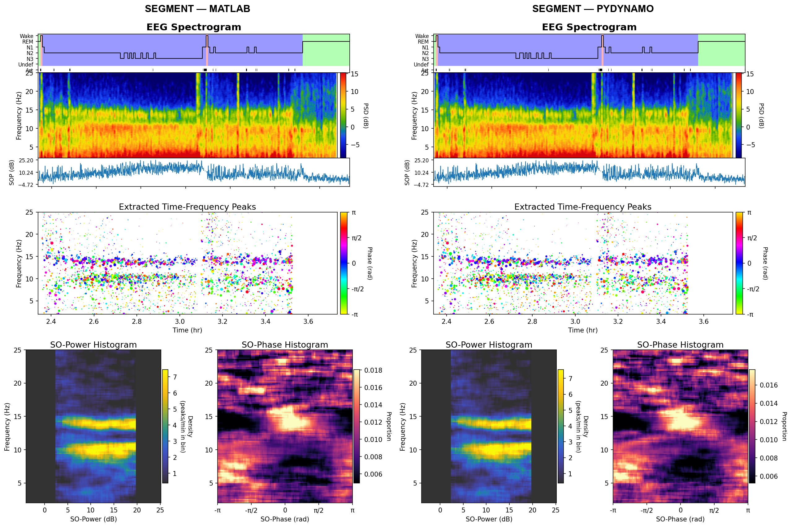
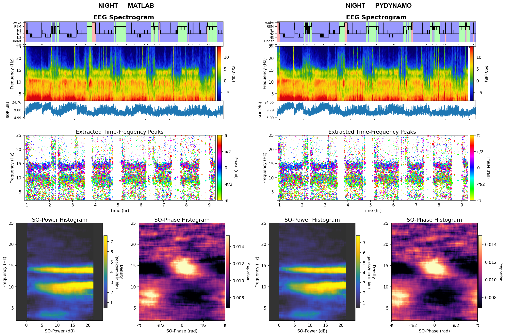

# pyDYNAM-O

Python + Rust port of [DYNAM-O](https://github.com/preraulab/DYNAM-O): TF-peak
extraction (double watershed + merge + trim + Hann refinement), SO-power /
SO-phase histograms, and a MATLAB-style summary figure.

## Siblings

This repo is one of three coordinated implementations of DYNAM-O:

- **[DYNAM-O](https://github.com/preraulab/DYNAM-O)** — authoritative MATLAB implementation. Source-of-truth algorithm, File Manager GUI, full statistical testing suite.
- **[DYNAM-O_rs](https://github.com/preraulab/DYNAM-O_rs)** — shared pure-Rust kernel (`dynamo_rs`). The hot paths in both MATLAB (via MEX) and Python (via PyO3) delegate here.
- **[DYNAM-O_toolbox](https://github.com/preraulab/DYNAM-O_toolbox)** — parent meta-repo pinning all three as git submodules.

## Rust acceleration

The `dynamo_rs` crate (lives in the sibling `DYNAM-O_rs` repo) accelerates the hot paths and now covers the full pipeline surface:

Extract / refine hot paths (the main speedup):
- `matlab_watershed` — bit-identical to MATLAB IPT `watershed` (Vincent-Soille + FIFO priority).
- `merge_segment` — port of `mergeWshedSegment` with the symmetric `edgeWeightEqual` rule.
- `trim_regions` — port of `trimWshedRegions`.
- `matlab_paint_labels` — 8-conn paint-in-label-order border filling; `pydynamo/tfpeaks/extract.py` now routes through this when `dynamo_rs` is available, which tightens pydynamo↔MATLAB peak-count parity.
- `mask_spectrogram`, `hann_event_spectra`, `refine_from_spectra`, `tfpeak_histogram`.

Time-series + metadata pipelines (ported this session — mirror pydynamo 1:1):
- `so_power_from_spectrogram` — post-MTS SO-power pipeline (band-integrate → pow2db → stage interp → outlier z-score → percentile-shift normalization → optional upsample). Bit-identical to `pydynamo.soph.sopower.compute_so_power`.
- `so_phase_from_eeg` — sosfiltfilt → hilbert → atan2 → unwrap → exclusion masking → stage interp. Bit-identical to `pydynamo.soph.sophase.compute_so_phase`.
- `detect_artifacts` — two-band (HF + BB) robust-z-score artifact detection. Bit-identical to `pydynamo.artifacts.detect_artifacts(..., slope_test=False)`. (Slope-test branch is a follow-up — needs multitaper.)
- `build_baseline_exclude`, `compute_baseline`, `subtract_baseline` — full baseline subpipeline.
- `hilbert`, `sosfiltfilt`, `movmean`, `unwrap` — raw primitives (pydynamo already picks `movmean` up for the artifact detrend).

Multitaper spectrogram delegates to the existing
[`multitaper_rs`](https://github.com/preraulab/multitaper_toolbox) crate.

## Accuracy vs MATLAB reference

Validated end-to-end against `runDYNAMO` on the bundled example EEG, using the
real MATLAB pipeline defaults (`detection_opts()`, `baseline_opts()`,
`SOpowerphasehist_opts()`). Per-stage intermediates are compared via
`scripts/bisect/*.py` against ground-truth `.mat` files exported by
`scripts/export_*.m`.

| dataset | pydynamo peaks | MATLAB peaks | diff | **SOpower cos** | **SOphase cos** |
|---|---:|---:|---:|---:|---:|
| segment (~84 min) | 5 785 | 5 738 | **+0.8 %** | **0.9958** | **0.9822** |
| full night (~8.4 h) | 34 911 | 34 788 | **+0.4 %** | **0.9973** | **0.9960** |

Stage-by-stage verification:

| stage | agreement vs MATLAB |
|---|---|
| multitaper spectrogram | max_rel ≈ 5e-5 (FFT-library floor) |
| artifacts | 99.99 % sample agreement |
| baseline (hazen prctile) | max_rel ≈ 1e-7 (bit-identical) |
| spect / baseline division | exact |
| watershed | bit-identical to MATLAB IPT |
| merge (post-merge region counts) | +0.1 % |
| pass-2 mask (interior − 1-px perimeter) | matches `maskSpectrogram` exactly |
| SOpower timeseries | cos = 1.0000 |
| SOphase timeseries (MATLAB-exact SOS filter) | cos ≈ 0.987 (edge transient); mid-90 % bit-identical (0.0006 rad median) |
| SOpower / SOphase histogram binning | bit-identical given same stats table |

## Runtime (full night, 8.4 h recording, macOS x86_64)

| stage | pydynamo | MATLAB | speedup |
|---|---:|---:|---:|
| **total end-to-end** | **101 s** | **146 s** | **1.45×** |
| extract pass-1 | 20 s | 84 s | 4.2× |
| extract pass-2 | 21 s | 32 s | 1.5× |

## Install from scratch

### Prerequisites

- **Python ≥ 3.9**
- **Rust toolchain** (`cargo`, `rustc`) — install via [rustup](https://rustup.rs/):
  ```bash
  curl --proto '=https' --tlsv1.2 -sSf https://sh.rustup.rs | sh
  ```
- **maturin** — builds the Rust extensions against CPython:
  ```bash
  pip install maturin
  ```
- **MATLAB is NOT required** to run the pipeline. It is only needed to
  regenerate ground-truth `.mat` intermediates under `data_cache/` (the
  `scripts/export_*.m` files). Accuracy benchmarking against MATLAB uses
  those exported files, which can be produced once and reused.

### Install

```bash
git clone git@github.com:preraulab/DYNAM-O_py.git
cd DYNAM-O_py

# (recommended) fresh virtualenv. On Apple Silicon make sure this is a native
# arm64 interpreter — an x86_64 Python builds x86_64 wheels that run under
# Rosetta, which costs several-fold on exactly the kernels dynamo_rs exists to
# speed up. Check with: python -c "import platform; print(platform.machine())"
python -m venv .venv && source .venv/bin/activate
pip install --upgrade pip maturin

# Build + install the Rust kernel (dynamo_rs). It lives in the sibling
# DYNAM-O_rs repo; the `python` feature enables the PyO3 bindings. Skip the
# clone if you already have the DYNAM-O_toolbox meta-repo layout.
[ -d ../DYNAM-O_rs ] || git clone git@github.com:preraulab/DYNAM-O_rs.git ../DYNAM-O_rs
maturin develop --release --features python -m ../DYNAM-O_rs/rust/Cargo.toml

# Build + install the multitaper spectrogram Rust extension (multitaper_rs).
# It ships as a submodule of DYNAM-O_dev:
maturin develop --release \
    -m ../DYNAM-O_dev/toolbox/helper_functions/multitaper_toolbox/rust/Cargo.toml

# Install the Python package
pip install -e .

# (optional) test dependencies
pip install -e '.[test]'
```

Python runtime deps (installed automatically by `pip install -e .`):
numpy ≥ 1.24, scipy ≥ 1.11, scikit-image ≥ 0.22, matplotlib ≥ 3.7, pandas ≥ 2.0,
joblib ≥ 1.3, tqdm ≥ 4.65, colorcet ≥ 3.0.

## Usage

### Recommended sampling frequency: 100 Hz

Pydynamo analyzes 0–30 Hz, so 100 Hz Nyquist is well above anything the
pipeline cares about. Resampling higher-rate recordings (128 / 200 /
256 / 500 / 1000 Hz) **down** to 100 Hz before calling `run_dynamo`
gives a ~2× end-to-end speedup with zero analytical change. The
multitaper-spectrogram NFFT is `2^nextpow2(Fs / mtm_dsfreqs)` (default
`mtm_dsfreqs = 0.1`), so anything above **Fs = 102.4 Hz** doubles NFFT
and spills the spectrogram past CPU L3 cache, costing 2–3× more on
every downstream stage. Resample with scipy:

```python
import numpy as np
from scipy.signal import resample_poly

target_fs = 100
if Fs != target_fs:
    from fractions import Fraction
    f = Fraction(target_fs, int(Fs)).limit_denominator(1000)
    data = resample_poly(data, f.numerator, f.denominator)
    Fs = target_fs
```

Zero analytical loss for sleep oscillations (slow oscillations 0.3–1.5 Hz,
spindles 11–16 Hz, alpha 8–12 Hz, beta 13–30 Hz are all far below 50 Hz
Nyquist). Skip the resample only if you specifically need spectral content
above 50 Hz (e.g., gamma analysis beyond pydynamo's analyzed band).

### Basic call

```python
import scipy.io as sio
from pydynamo import run_dynamo

m = sio.loadmat("example_data.mat", simplify_cells=True)
out = run_dynamo(
    m["data"].ravel(),
    float(m["Fs"]),
    m["stage_times"],
    m["stage_vals"],
    # MATLAB runExampleData.m 'segment' overrides (omit for full-night defaults)
    time_range=(8420.0, 13446.0),
    min_time_in_bin=5,
    min_peak_at_freq=10,
)
print(out.stats_table.head())       # per-peak stats
print(out.SOPHs.SOpower_mat.shape)  # (freq_bins, SOpower_bins)
```

## Stage convention

DYNAM-O uses `1=N3, 2=N2, 3=N1, 4=REM, 5=Wake` — reversed from most EDF
stagers. Pass stages in this convention or histograms will be empty or
inverted.

## Side-by-side figures

`scripts/compare_matlab_vs_pydynamo.py` renders MATLAB's output and
pydynamo's output through the identical `summary_plot` code, so any visual
difference is pure data difference (not color scaling or layout).





## Validation data

All ground-truth comparison uses `runDYNAMO` output from the DYNAM-O repo's
bundled example EEG (`example_data.mat`). Regenerate MATLAB intermediates
once from the DYNAM-O repo root:

```matlab
run('<path-to-DYNAM-O_py>/scripts/export_bisect_intermediates.m')
run('<path-to-DYNAM-O_py>/scripts/export_merge_diagnostics.m')
run('<path-to-DYNAM-O_py>/scripts/export_pass1_diagnostics.m')
```

These populate `data_cache/` with `.mat` / `.csv` files (not version-controlled).

## Tests

```bash
pytest tests/
```

Smoke + unit coverage for spectrogram, artifacts, baseline, SOpower timeseries,
SOpower histogram binning from MATLAB peaks, slope_test, watershed-vs-MATLAB
equivalence, and an end-to-end run.
